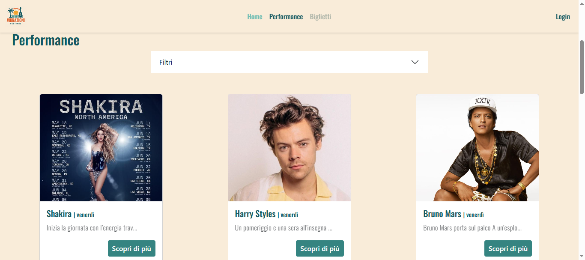
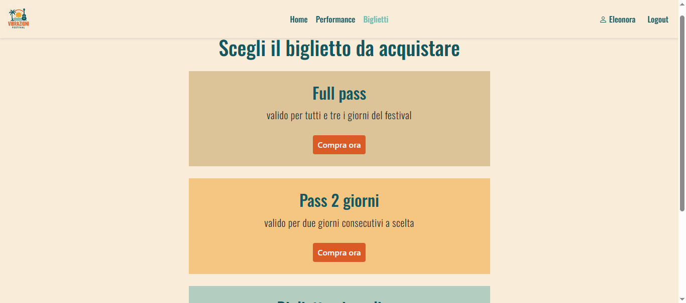
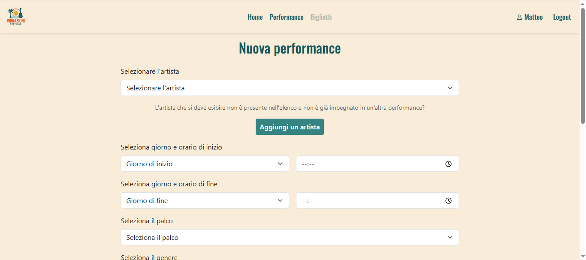

# Vibrazioni Festival

Applicazione web full-stack dedicata alla gestione di un festival musicale di 3 giorni (venerdì-sabato-domenica) su 3 palchi paralleli. Il sistema gestisce due tipi di utenti con permessi ed esperienze diverse. I partecipanti possono consultare il programma delle esibizioni, filtrarlo per giorno/genere/palco e acquistare un biglietto, mentre gli organizzatori possono aggiungere artisti, creare e pubblicare performance, salvarle come bozza, modificarle o eliminarle.

---

## Funzionalità principali

- Autenticazione e gestione sessioni con Flask-Login, password hashate con Werkzeug
- Homepage con filtri combinabili per giorno, genere e palco
- Sistema di acquisto biglietti con controllo del tetto massimo di presenze per giornata
- Creazione performance con:
  - validazione dei campi e della durata (calcolo automatico in minuti)
  - controllo automatico di sovrapposizione oraria sullo stesso palco (con fallback a bozza se il conflitto viene rilevato)
  - salvataggio come bozza o pubblicazione definitiva
  - upload e resize automatico delle immagini (copertina + foto multiple) con Pillow
  - gestione ed eliminazione delle foto extra già caricate
- Gestione anagrafica artisti (con controllo duplicati e biografia opzionale)
- Pagina profilo dinamica in base al ruolo (statistiche di vendita per l'organizzatore, biglietto acquistato per il partecipante)

## Stack tecnico

| Livello | Tecnologie |
|---|---|
| Backend | Python, Flask, Flask-Login |
| Database | SQLite |
| Frontend | HTML5, Jinja2, CSS3, Bootstrap 5 |
| Altro | Pillow (elaborazione immagini) |

## Database

**UTENTI:** (id (PK), email (UNIQUE), password, nome, cognome, is_partecipante)

**ARTISTI:** (id (PK), nome (UNIQUE), foto_profilo, biografia)

**PALCHI:** (id (PK), nome (UNIQUE))

**GENERI:** (id (PK), nome (UNIQUE))

**PERFORMANCE:** (id (PK), id_artista (FK → artisti.id), id_organizzatore (FK → utenti.id), id_palco (FK → palchi.id), id_genere (FK → generi.id), giorno_inizio, ora_inizio, giorno_fine, ora_fine, immagine_copertina, is_pubblicata, durata, descrizione)

**FOTO_PERFORMANCE:** (id (PK), id_performance (FK → performance.id), foto)

**BIGLIETTI:** (id (PK), nome, venerdi, sabato, domenica, descrizione, nome_visualizzato)

**ACQUISTI_BIGLIETTI:** (id_utente (PK, FK → utenti.id), id_biglietto (FK → biglietti.id), data_acquisto, ora_acquisto)

---

## Screenshot

### Home


### Acquisto biglietti


### Nuova performance


---

## Credenziali di test

| Email | Password | Ruolo |
|---|---|---|
| matteo.rossi@example.com | matteo01 | Organizzatore |
| martina.bianchi@example.com | martina01 | Organizzatore |
| federico.conti@example.com | federico01 | Partecipante |
| eleonora.moretti@example.com | eleonora01 | Partecipante |
| lorenzo.ferrari@example.com | lorenzo01 | Partecipante |

## Avvio in locale

```bash
flask run
```
L'app sarà disponibile su `http://127.0.0.1:5000`